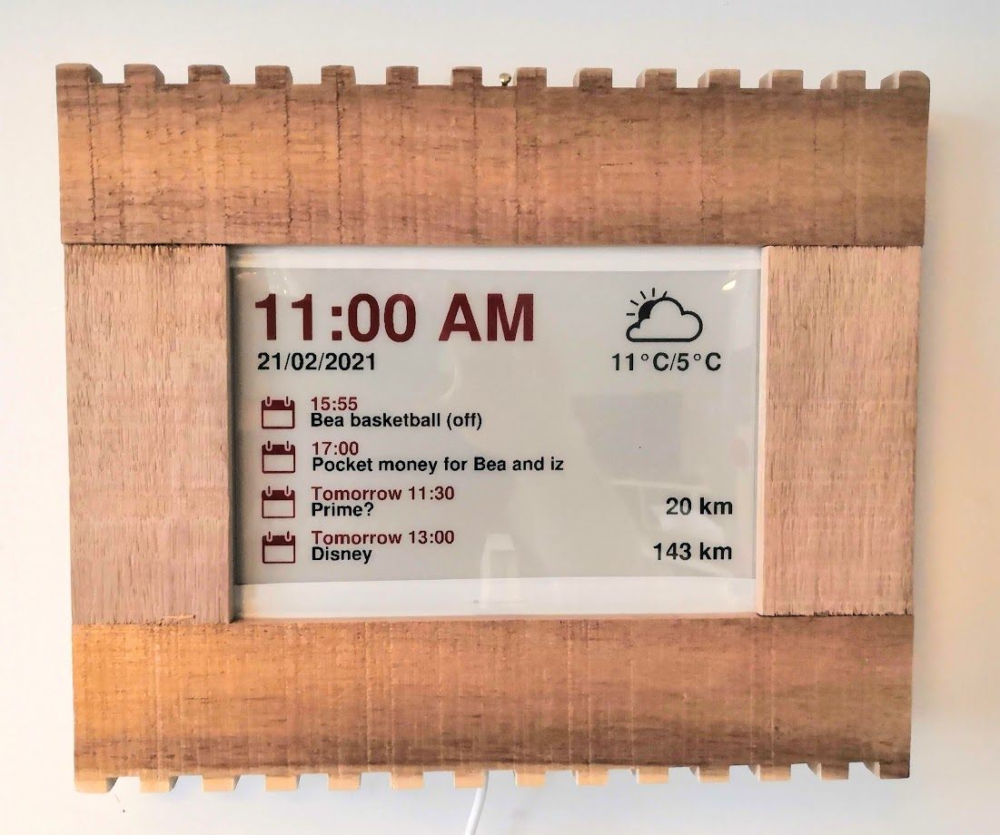

Instructions on setting up a Raspberry Pi Zero WH with a Waveshare ePaper 7.5 Inch HAT. 
The screen will display date, time, weather icon with high and low, Google Calendar entries.

## Shopping list

[Waveshare 7.5 inch epaper display HAT 800x480, Red/Black/White](https://www.waveshare.com/product/displays/e-paper/epaper-1/7.5inch-e-paper-hat-b.htm)
[Raspberry Pi Zero WH (presoldered header)](https://www.amazon.co.uk/gp/product/B07BHMRTTY/)  
[microSDHC card](https://www.amazon.co.uk/gp/product/B073K14CVB)

## Setup the PI

(jm: these instructions are verbatim from [mendhak's original](https://github.com/mendhak/waveshare-epaper-display); I used a Raspberry Pi 4 with a little more CPU power.)

Use [Etcher](https://etcher.io) to write the SD card with the [Raspbian Stretch Lite](https://www.raspberrypi.org/downloads/raspbian/) image, no need for desktop.

After the image has been written,

### Enable SSH 

Create a file called `ssh` in the boot partition of the card.

    sudo touch /media/mendhak/boot/ssh

### Enable WiFi

Create a file called `wpa_supplicant.conf` in the boot partition 

    sudo nano /media/mendhak/boot/wpa_supplicant.conf

with these contents    

    update_config=1
    country=GB

    network={
        ssid="yourwifi"
        psk="wifipasswd"
        key_mgmt=WPA-PSK
    }

### Start the Pi

Connect the Pi to power, let it boot up.  In your router devices page, a new connected device should appear.  If all goes correctly then the pi should be available with its FQDN even.

    ssh pi@raspberrypi.lan

Login with the default password of raspberry and change it using `passwd`

### Connect the display

Put the HAT on top of the Pi's GPIO pins.  

Connect the ribbon from the epaper display to the extension.  To do this you will need to lift the black latch at the back of the connector, insert the ribbon slowly, then push the latch down. 

## Setup dependencies

    sudo apt install git ttf-wqy-zenhei ttf-wqy-microhei python3 python3-pip python-imaging libopenjp2-7-dev libjpeg8-dev inkscape figlet wiringpi netpbm
    sudo pip3 install astral spidev RPi.GPIO Pillow  # Pillow took multiple attempts to install as it's always missing dependencies
    sudo pip3 install --upgrade google-api-python-client google-auth-httplib2 google-auth-oauthlib
    sudo sed -i s/#dtparam=spi=on/dtparam=spi=on/ /boot/config.txt  #This enables SPI
    sudo reboot

### Get the BCM2835 driver

    wget http://www.airspayce.com/mikem/bcm2835/bcm2835-1.58.tar.gz
    sudo tar zxvf bcm2835-1.58.tar.gz
    cd bcm2835-1.58/
    sudo ./configure
    sudo make
    sudo make check
    sudo make install

## Using this application

### Clone it

git clone this repository in the `/home/pi` directory.

    cd /home/pi
    git clone --recursive https://github.com/jmason/waveshare-epaper-display.git
    
This should create a `/home/pi/waveshare-epaper-display` directory. 

### Waveshare version

Copy `env.sh.sample` (example environment variables) to `env.sh` 

Modify the `env.sh` file and set the version of your Waveshare 7.5" e-Paper Module  (newer ones are version 2)

    export WAVESHARE_EPD75_VERSION=2

### Climacell API key

Modify the `env.sh` file and put your [Climacell API key](https://www.climacell.co/weather-api/) in there.  

    export CLIMACELL_APIKEY=xxxxxx

Climacell API is used for the weather forecast as well as several weather icons.

### Location information for Weather

Modify the `env.sh` file and update with the latitude and longitude of your location. As needed, change the temperature format (CELSIUS or FAHRENHEIT).

    export WEATHER_FORMAT=CELSIUS
    export WEATHER_LATITUDE=51.3656
    export WEATHER_LONGITUDE=0.1963

### Google Calendar token

The Oauth process needs to complete once manually in order to allow the Python code to then continuously query Google Calendar for information. 
Go to the [Python Quickstart](https://developers.google.com/calendar/quickstart/python) page and enable Google Calendar API.  When presented, download or copy the `credentials.json` file and add it to this directory. 

Next, SSH to the Raspberry Pi and run

    python3 screen-calendar-get.py

The script will prompt you to visit a URL in your browser and then wait.  Copy the URL, open it in a browser and you will go through the login process.  When the OAuth workflow tries to redirect back (and fails), copy the URL it was trying to go to (eg: http://localhost:8080/...) and in another SSH session with the Raspberry Pi, 

    curl "http://localhost:8080/..." 

On the first screen you should see the auth flow complete, and a new `token.pickle` file appears.  The Python script should now be able to run in the future without prompting required.  

### HomeAssistant settings

Modify the `env.sh` file and update with the URL of your local HomeAssistant installation:

    export HASS_URL='http://your.local.homeassistant.url:8123/'

Create a long-lived access token in the HomeAssistant UI for this script to use to access it; see https://developers.home-assistant.io/docs/auth_api/#long-lived-access-token for details.  Paste the value here:

    export HASS_BEARER_TOKEN=xxxxxxxx

Pick whichever sensors you plan to use (in my case the battery levels of the two household electric cars), and the template strings which their values will be inserted into in the InkScape SVG template:

    export HASS_SENSORS='{
        "sensor.car1_range_electric":"HCR_1",
        "sensor.car2_range":"HCR_2"
    }'

### Run it

Run `./run.sh` which should query Climacell, HomeAssistant and Google Calendar.  It will then create a png, convert to a pair of 1-bit bmps for black/white and black/red layers, then display the bmp on screen. 

Unfortunately, the red/black/white 7.5 inch display has a very slow refresh time, about 30 seconds, and doesn't support any kind of partial refresh at the moment.

### Automate it

Once you've proven that the run works, and an image is sent to your epaper display, you can automate it by setting up a cronjob.  

    crontab -e

Add this entry so it runs every hour:

    0 * * * * bash /home/pi/waveshare-epaper-display/run.sh

This will cause the script to run every hour, and write the output as well as errors to a file called LOG.  You can potentially
run this more frequently, but note that every refresh involves 30 seconds of screen flashing, which is quite intrusive.

## Waveshare documentation and sample code

Waveshare have a [user manual](https://www.waveshare.com/w/upload/7/74/7.5inch-e-paper-hat-user-manual-en.pdf) which you can get to from [their Wiki](https://www.waveshare.com/wiki/7.5inch_e-Paper_HAT)

The [Waveshare demo repo is here](https://github.com/waveshare/e-Paper).  Assuming all dependencies are installed, these demos should work.  

    git clone https://github.com/waveshare/e-Paper
    cd e-Paper

This is the best place to start for troubleshooting - try to make sure the examples given in their repo works for you. 

[Readme for the C demo](https://github.com/waveshare/e-Paper/blob/master/RaspberryPi_JetsonNano/c/readme_EN.txt)

[Readme for the Python demo](https://github.com/waveshare/e-Paper/blob/master/RaspberryPi_JetsonNano/python/readme_jetson_EN.txt)

